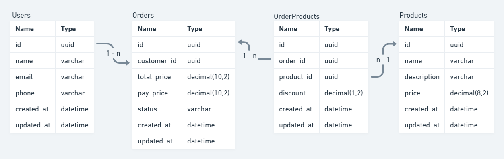

### How is it supposed to work?
Well...  
I'm making an small shop system, where any user can make orders with many products into it.  
The main idea is: create the application following the DDD and TDD patterns, and then, try different
features to see how the server performance reacts and which feature is better to this situation through a load test.

 

### Used patterns and platforms
- `DDD`: I'll try to write the simple structure based on some DDD principles.
- `SOLID`
- `TDD`: I'll be loyal to this pattern and use the best practices.
- `Knex`: Used to make the database connection easier and as a query builder.
- `Sqlite3`: In memory database (SQL)
- `Typescript`
- `Vitest`: To make unit and functional tests.
- `Autocannon`: Used to make load tests.

 

### Database schema
